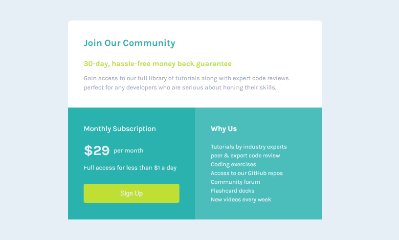

# Frontend Mentor -Single-Price-Grid solution

This is my solution to the Single-Price-Grid on Frontend Mentor. Frontend Mentor challenges help you improve your coding skills by building realistic projects. 

## Table of contents

- [Overview](#overview)
  - [The challenge](#the-challenge)
  - [Screenshot](#screenshot)
  - [Links](#links)
- [My process](#my-process)
  - [Built with](#built-with)
  - [What I learned](#what-i-learned)
  - [Continued development](#continued-development)
  - [Useful resources](#useful-resources)
- [Author](#author)
- [Acknowledgments](#acknowledgments)
 
## Overview
-This project is my solution to the -Single-Price-Grid challenge from Frontend Mentor
-The goal of this challenge was to build a responsive multi-device display that matches the given design and adapts well across different screen sizes.

### Screenshot

### Links

- Solution URL: [Add solution URL here](https://your-solution-url.com)
- Live Site URL: https://nathan5792.github.io/Single-Price-Grid-Design/

## My process
-Started by setting up the basic HTML structure with semantic elements.
-Styled the layout using CSS Flexbox and CSS Grid for alignment and responsiveness.
-Used media queries to ensure the card-Section looks good on both mobile and desktop screens including tablets and mini ipads.
-Tested the design in different screen sizes to fine-tune responsiveness.

### Built with

-Semantic HTML5 markup
-CSS3 custom properties
-Flexbox and CSS-Grid for layout
-Responsive design techniques

### What I learned
-How to structure a clean and re-usable card-Section component with multiple sections.
-Improved my understanding of responsive layouts with Flexbox, CSS-Grid and media queries.
-Learned how to better manage spacing, typography, and alignment for pixel-perfect results.
-Gained experience in replicating real-world designs more accurately.

### Continued development

Most if not all of website designs are created using css grid and flexbox, this are the most useful and complex concepts of html and css that i would personally want to have first hand pro experience on. Therefore, those skills would allow me to develop clean code website designs. with this 

### Useful resources
- https://www.w3schools.com - This is an amazing article which helped me with all the css grid and flexbox concepts and anything related with website  development. I'd recommend it to anyone still learning this concepts.

## Author
- Frontend Mentor - [@nathanclass2-source](https://www.frontendmentor.io/profile/nathanclass2-source)
- GitHub - [@nathanclass2-source](https://www.frontendmentor.io/profile/nathanclass2-source)

